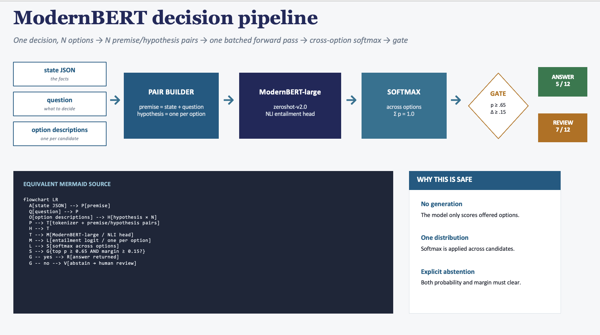
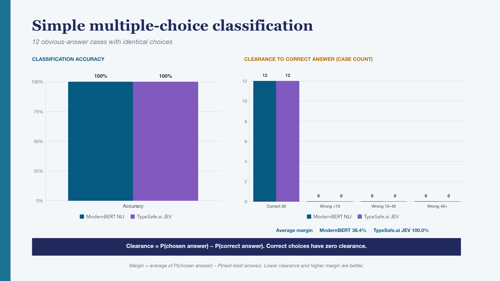
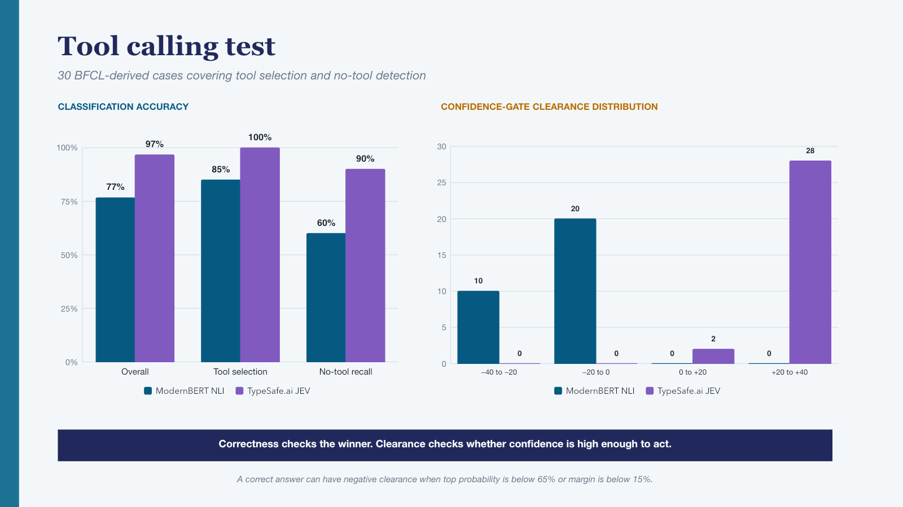
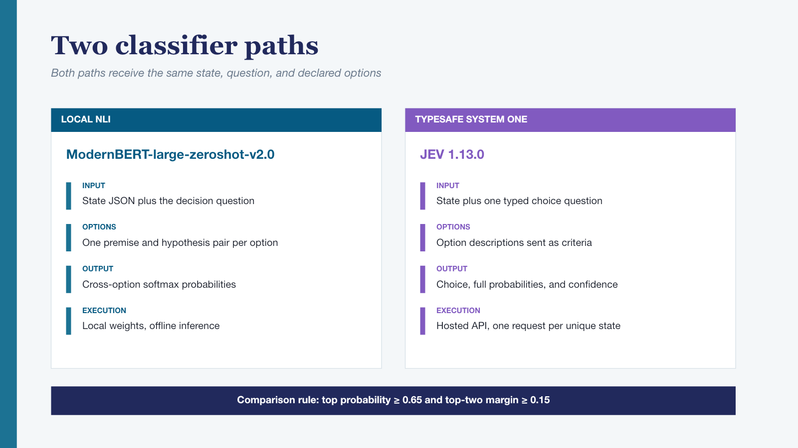
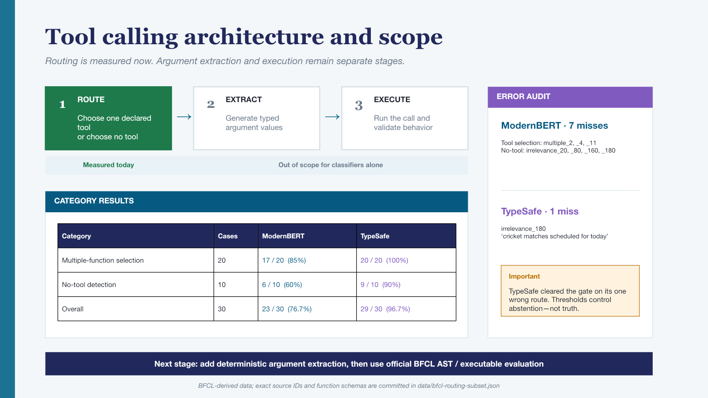

# OpenSystem1 Classifier

This repo represents an independent smoke test comparing TypeSafe.ai JEV with a
traditional zero-shot ModernBERT classifier on simple multiple-choice
classification and BFCL-derived tool routing.

Both are non-generative decision systems in this experiment:

1. A local Natural Language Inference classifier using [ModernBERT-large-zeroshot-v2.0](https://huggingface.co/MoritzLaurer/ModernBERT-large-zeroshot-v2.0).
2. The hosted [TypeSafe System One API](https://docs.typesafe.ai/api), using JEV 1.13.0.

Both receive the same state, question, and declared choices. Both return a
selected option and a probability distribution rather than unrestricted prose.

## The classification pattern predates JEV

JEV is new, but constrained classification is not. Since the original
[BERT paper](https://arxiv.org/abs/1810.04805), encoder models have commonly
been adapted to classify inputs or score a fixed set of candidate labels without
generating an answer token by token. The ModernBERT baseline used here turns
each candidate into an NLI hypothesis, scores all candidates in one batched
forward pass, and applies a softmax across the options.



*The 5/12 answer and 7/12 review counts in the diagram describe the optional
probability-and-margin abstention gate, not accuracy. ModernBERT's top-ranked
choice was correct on all 12 simple cases.*

This similarity in task shape motivates the comparison; it does **not** imply
that JEV is a BERT model. TypeSafe.ai describes JEV as a new architecture with a
parallel sampler and a training method called Reinforcement Learning for
Calibrated Decisions. It is designed for typed decisions inside software rather
than general-purpose text generation.

## JEV and ModernBERT compared

| Dimension | ModernBERT NLI baseline | TypeSafe.ai JEV 1.13.0 |
|---|---|---|
| Model approach | Open-weight ModernBERT encoder with an NLI entailment head | TypeSafe.ai System One model exposed through a hosted API |
| Deployment | Runs locally on CPU, GPU, or Apple Silicon | Runs through the TypeSafe.ai service |
| Input construction | Builds one premise/hypothesis pair for every candidate option | Sends state plus one or more typed questions and declared answer choices |
| Decision computation | Scores the candidate pairs in one batched forward pass, then applies cross-option softmax | Returns typed decisions; the API supports evaluating multiple questions over the same state in one request |
| Output | Locally calculated option probabilities, top choice, margin, and optional abstention | Declared choice, probability distribution, and confidence returned by the API |
| Free-form generation | None | None |
| Model access | Downloadable checkpoint under Apache-2.0 | Hosted early-access model; weights are not distributed with this repository |
| Cost model | No per-token API charge; infrastructure cost depends on local hardware | Published price: $0.042 per million input tokens and no output-token charge |
| Latency | Depends on local hardware and batch size | TypeSafe.ai publishes a 70–500 ms operating range; this repo does not make a controlled latency comparison |
| Simple multiple choice | 12/12 correct; 38.4% average top-two margin | 12/12 correct; 100.0% average top-two margin |
| BFCL-derived tool routing | 23/30 correct (76.7%) | 29/30 correct (96.7%) |

The JEV interface and operating figures above come from TypeSafe.ai's
[launch announcement](https://typesafe.ai/blog/introducing-system-one-models-and-jev),
[model documentation](https://docs.typesafe.ai/models), and
[question primitives](https://docs.typesafe.ai/primitives). The benchmark rows
come from the committed result files in this repository.

## Benchmark result

| Measure | ModernBERT NLI | TypeSafe.ai JEV 1.13.0 |
|---|---:|---:|
| Correct top-ranked answers | 12/12 | 12/12 |
| Accuracy | 100% | 100% |
| Average clearance | 0.0% | 0.0% |
| Average top-two margin | 38.4% | 100.0% |

The presentation uses these definitions:

```text
clearance = probability(chosen answer) - probability(correct answer)
margin = average(probability(chosen answer) - probability(next-best answer))
```

Clearance is zero when the chosen answer is correct. A positive value means an
incorrect option outranked the correct answer, so lower clearance is better.
Margin measures how far the selected option is ahead of the runner-up, so a
higher average margin indicates more separation.

TypeSafe.ai JEV returned literal `1.0` / `0.0` probability distributions and `confidence: 1.0` for all 12 cases. The client did not round or threshold those responses. The POC calculates margin and clearance locally after receiving the API response. This easy benchmark demonstrates separation in reported probabilities, but it does not establish real-world calibration.



The original 12-question presentation is in
[`results/OpenSystem1-classifier-comparison.pptx`](results/OpenSystem1-classifier-comparison.pptx).
The current smoke-test deck, including the BFCL-derived Stage-1 results,
clearance distributions, and average margins, is
[`results/Smoke-Test-Comparison-System1-vs-ModernBERT-clearance-distributions.pptx`](results/Smoke-Test-Comparison-System1-vs-ModernBERT-clearance-distributions.pptx).

## Stage 1: BFCL-derived tool routing

The second benchmark isolates the part of tool calling that both classifiers can
perform fairly: select one declared tool, or determine that no supplied tool is
callable. It uses 30 cases derived from the official BFCL V4 data at commit
`6ea57973c7a6097fd7c5915698c54c17c5b1b6c8`:

| Measure | ModernBERT NLI | TypeSafe.ai JEV 1.13.0 |
|---|---:|---:|
| Overall routing accuracy | 23/30 (76.7%) | 29/30 (96.7%) |
| Multiple-function selection | 17/20 (85%) | 20/20 (100%) |
| No-tool detection | 6/10 (60%) | 9/10 (90%) |
| Average clearance | 0.6% | 1.5% |
| Average top-two margin | 8.7% | 95.4% |

The TypeSafe.ai JEV responses were not uniformly `1.0` on this harder set: 25 of 30
had a top probability of `1.0`; the remaining five ranged from `0.70` to `0.97`.
Its one wrong route assigned `0.72` to the selected tool and `0.28` to the
correct no-tool option, producing a 44-point clearance. This is why lower
clearance is better under the definition used here.

This is a **BFCL-derived routing benchmark, not an official BFCL leaderboard
score**. Official AST and executable evaluation also requires argument
generation and execution, which neither classifier performs by itself. See
[`docs/bfcl-routing-benchmark.md`](docs/bfcl-routing-benchmark.md) for the
protocol and interpretation.



## Architecture

Both classifier paths receive the same state, question, and declared options. ModernBERT runs locally and scores premise/hypothesis pairs. TypeSafe.ai JEV receives a typed choice question through the hosted System One API.



The Stage-1 tool benchmark measures routing only. Argument extraction and execution remain separate stages required for a full BFCL evaluation.



## Repository layout

```text
poc/
  build_bfcl_routing_subset.py    Reproducible extraction from official BFCL data
  bfcl_routing_benchmark.py       Shared ModernBERT / TypeSafe routing runner
  test_bfcl_routing_benchmark.py  Dataset and metric tests
  update_deck_bfcl_routing.mjs    Editable PowerPoint update
  rebuild_smoke_test_deck.mjs     Reordered deck, clearance distributions, and margins
  zero_shot_decision_poc.py       Local typed decision engine
  obvious_answers_benchmark.py    Shared 12-question benchmark
  typesafe_decision_poc.py        TypeSafe HTTP client
  test_zero_shot_decision_poc.py  Unit tests that require no model download
  zero_shot_decision_input.json   Single-request example
  requirements-zero-shot-decisions.txt
  build_benchmark_deck.py         Original ModernBERT deck builder
  deck_appendix.py                ModernBERT architecture and code appendix
  check_deck_geometry.py          PowerPoint geometry checks
results/
  benchmark-results.json
  typesafe-benchmark-results.json
  typesafe-benchmark-raw-responses.json
  modernbert-benchmark-results.pptx
  OpenSystem1-classifier-comparison.pptx
  OpenSystem1-classifier-comparison-stage1.pptx
  Smoke-Test-Comparison-System1-vs-ModernBERT-clearance-distributions.pptx
  bfcl-routing-modernbert-results.json
  bfcl-routing-typesafe-results.json
  bfcl-routing-typesafe-raw-responses.json
data/
  bfcl-routing-subset.json
  README.md
docs/
  bfcl-routing-benchmark.md
  linkedin-post.md
  zero-shot-alternatives.md
```

Model weights and API credentials are intentionally excluded.

## Quick start

The following commands reproduce the local ModernBERT multiple-choice benchmark from a fresh clone:

```bash
git clone https://github.com/maustin10/OpenSystem1-classifier.git
cd OpenSystem1-classifier

python3 -m venv .venv
source .venv/bin/activate
python -m pip install --upgrade pip
python -m pip install -r poc/requirements-zero-shot-decisions.txt
python -m pip install huggingface_hub pytest

mkdir -p models
hf download MoritzLaurer/ModernBERT-large-zeroshot-v2.0 \
  --local-dir models/modernbert-zeroshot

HF_HUB_OFFLINE=1 python poc/obvious_answers_benchmark.py \
  --model models/modernbert-zeroshot
```

The first download requires internet access and enough local disk space for the model. The `models/` directory and common model-weight formats are ignored by Git. After downloading, `HF_HUB_OFFLINE=1` ensures the benchmark uses only the local copy.

## Requirements

- Python 3.10 or later
- About 1 GB of free disk space for the ModernBERT checkpoint and tokenizer
- PyTorch-compatible CPU, CUDA GPU, or Apple Silicon GPU
- A TypeSafe API key only if you want to run the hosted comparison

Create an environment:

```bash
python3 -m venv .venv
source .venv/bin/activate
python -m pip install --upgrade pip
python -m pip install -r poc/requirements-zero-shot-decisions.txt
```

For tests and model download support:

```bash
python -m pip install pytest huggingface_hub
```

## Download ModernBERT

The local scorer defaults to `MoritzLaurer/ModernBERT-large-zeroshot-v2.0`. The model card describes a 0.4B-parameter, Apache-2.0 checkpoint built on ModernBERT-large.

### Option A: let Transformers download and cache it

Pass the Hugging Face repository id directly:

```bash
python poc/obvious_answers_benchmark.py \
  --model MoritzLaurer/ModernBERT-large-zeroshot-v2.0
```

Transformers downloads the files into the Hugging Face cache on the first run.

### Option B: download a portable local copy

This is the recommended setup for repeatable or offline use:

```bash
mkdir -p models
hf download MoritzLaurer/ModernBERT-large-zeroshot-v2.0 \
  --local-dir models/modernbert-zeroshot
```

Confirm that the weights exist:

```bash
ls -lh models/modernbert-zeroshot/model.safetensors
```

Then force offline inference:

```bash
export HF_HUB_OFFLINE=1
python poc/obvious_answers_benchmark.py \
  --model models/modernbert-zeroshot
```

Do not copy a Hugging Face cache snapshot without dereferencing symlinks. Using `hf download --local-dir` creates ordinary files and avoids dangling weight links.

## Run a single typed decision

```bash
python poc/zero_shot_decision_poc.py \
  --input poc/zero_shot_decision_input.json \
  --model models/modernbert-zeroshot
```

The scorer supports `--device auto`, `cpu`, `cuda`, or `mps`. `auto` prefers CUDA, then Apple MPS, then CPU.

## Run the 12-question ModernBERT benchmark

```bash
python poc/obvious_answers_benchmark.py \
  --model models/modernbert-zeroshot \
  --json > results/benchmark-results-new.json
```

The model loads once and scores every premise/hypothesis pair in batches.

## Run the TypeSafe comparison

Copy the safe example and add your key locally:

```bash
cp .env.example .env
```

Never commit `.env`. Then run:

```bash
python poc/typesafe_decision_poc.py \
  --output results/typesafe-benchmark-results-new.json \
  --raw-output results/typesafe-benchmark-raw-responses-new.json
```

The raw audit file records request and response JSON but never stores the API key. Use `--dry-run` to inspect the payload without calling the service.

## Run the BFCL-derived routing benchmark

The 30-case dataset is committed, so rebuilding it is optional. Run the local
model with:

```bash
HF_HUB_OFFLINE=1 python poc/bfcl_routing_benchmark.py \
  --backend modernbert \
  --dataset data/bfcl-routing-subset.json \
  --model models/modernbert-zeroshot \
  --output results/bfcl-routing-modernbert-results-new.json
```

Run TypeSafe with:

```bash
python poc/bfcl_routing_benchmark.py \
  --backend typesafe \
  --dataset data/bfcl-routing-subset.json \
  --env-file .env \
  --output results/bfcl-routing-typesafe-results-new.json \
  --raw-output results/bfcl-routing-typesafe-raw-responses-new.json
```

To regenerate the subset from the exact official source revision:

```bash
git clone https://github.com/ShishirPatil/gorilla.git ../gorilla
git -C ../gorilla checkout 6ea57973c7a6097fd7c5915698c54c17c5b1b6c8
python poc/build_bfcl_routing_subset.py \
  --bfcl-data-dir ../gorilla/berkeley-function-call-leaderboard/bfcl_eval/data \
  --output data/bfcl-routing-subset.json
```

## Run the tests

The tests use a fake scorer and do not download ModernBERT:

```bash
python -m pytest \
  poc/test_zero_shot_decision_poc.py \
  poc/test_bfcl_routing_benchmark.py \
  -q
```

Expected result: `15 passed`.

## Other zero-shot models to benchmark

The next useful comparison is [DeBERTa-v3-large-zeroshot-v2.0](https://huggingface.co/MoritzLaurer/deberta-v3-large-zeroshot-v2.0), because it uses the same NLI task shape and model family source. Other candidates include [BART-large-MNLI](https://huggingface.co/facebook/bart-large-mnli), multilingual [mDeBERTa-v3-base-MNLI-XNLI](https://huggingface.co/MoritzLaurer/mDeBERTa-v3-base-mnli-xnli), and [GLiClass](https://huggingface.co/knowledgator/gliclass-small-v1.0), which uses a more efficient classification architecture.

See [`docs/zero-shot-alternatives.md`](docs/zero-shot-alternatives.md) for the suggested evaluation order.

## Responsible interpretation

The 12 questions intentionally have obvious answers. They check plumbing, option framing, typed output, and abstention behavior. They do not measure production accuracy or calibration. Before deployment, add ambiguous, incomplete, adversarial, and domain-specific cases, then select thresholds from observed error costs.
